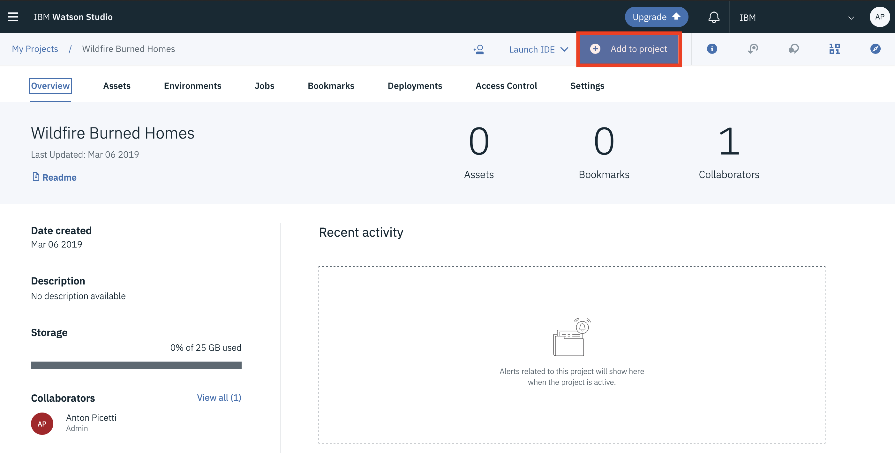
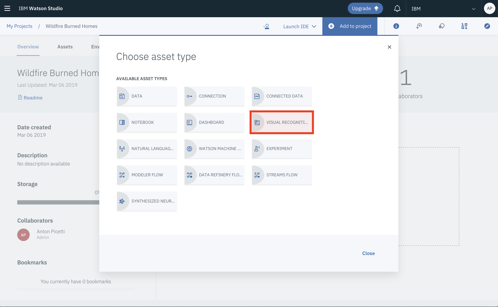
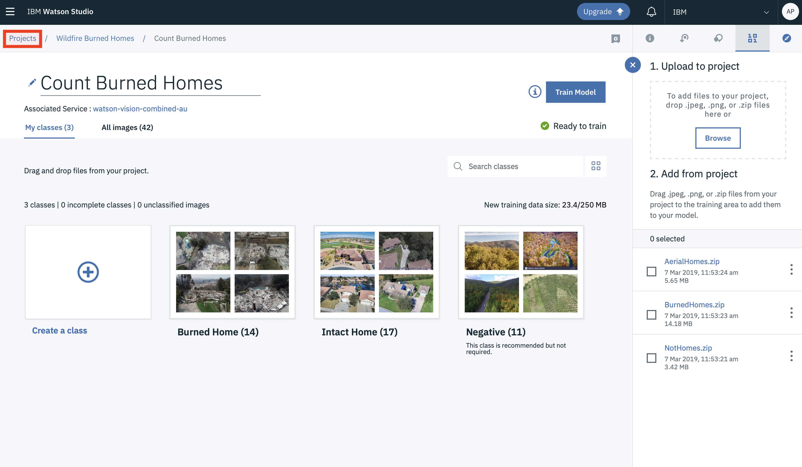
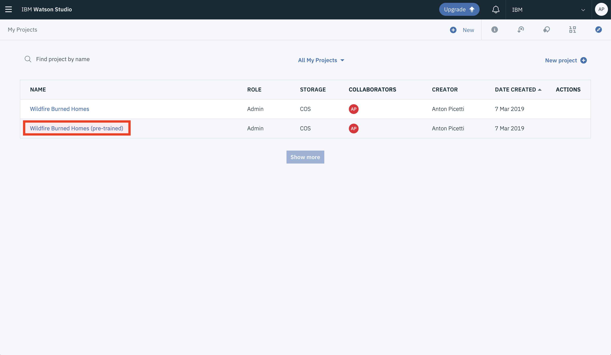
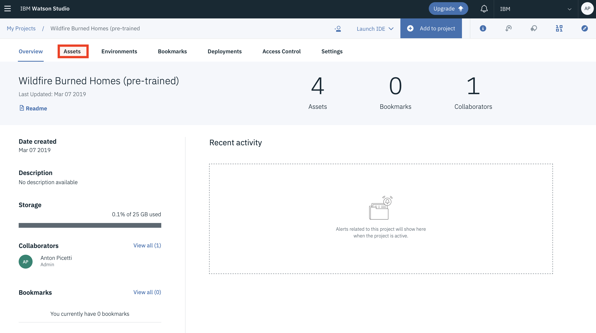
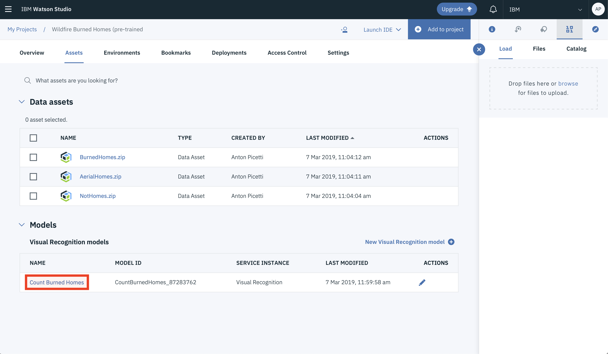

# Survey wildfire-damaged neighborhoods to identify burned homes and intact homes

 Use drone aerial images, Watson Studio, and Watson Visual Recognition to survey damage.

## Introduction

This hands on lab uses drone aerial images, Watson Studio and Watson Visual Recognition to survey wildfire damaged neighborhoods and identify burned homes and intact homes.


## Learning objectives

After completing this tutorial you will be able to:

- Create a Visual Recognition model in Watson Studio running in IBM Cloud

- Capture images from a drone and zip them into a class

- Train a model to identify objects in the images

- Score and count the identified objects

## Prerequisites

This tutorial can be completed using an IBM Cloud Lite account.

- Create an [IBM Cloud account](https://console.bluemix.net/registration)

- Log into [IBM Cloud](https://console.bluemix.net/login)

## Estimated time

You can complete this task in no more than 15 minutes.

## Step 1 - Capturing Images

One of the fun experiences of flying a drone is capturing video or pictures from a unique aerial perspective. You can use your drone to capture images of interesting objects that you want to train a visual recognition model to autonomously identify.

In this lab, we have created three zip files of pictures recorded by drones. The lab will use these images to identify neighborhoods affected by the devastating 2018 West Coast wildfires. These images will be used as our training set. 

- Aerial drone images of burned homes - [BurnedHomes.zip](https://github.com/AntonPicetti-IBM/drones-iot-visual-recognition/raw/master/WildFires/classes/BurnedHomes.zip)

- Aerial drone images of intact homes - [AerialHomes.zip](https://github.com/AntonPicetti-IBM/drones-iot-visual-recognition/raw/master/WildFires/classes/AerialHomes.zip)

- Aerial drone images of forests, roads, rivers to be used for the negative class. [NotHomes.zip](https://github.com/AntonPicetti-IBM/drones-iot-visual-recognition/raw/master/WildFires/classes/NotHomes.zip)

*Source attribution: USA Today [article](https://www.usatoday.com/in-depth/news/nation-now/2018/08/02/drone-aerials-california-wildfire-devastation/889885002/), various internet sources*

## Step 2 - Set up Watson Studio

In this section, we create a Project in Watson Studio and create a Watson Visual Recognition model to identify images in several classes.

### Watson Studio Projects

Projects are your workspace to organize your resources, such as assets like data, collaborators, and analytic tools like notebooks and models.

#### Create a New Project

1. Click on **Create a Project**.

   

2. Select the **Standard** tile and press the **Create Project** button.


3. Name your project **Wildfire Burned Homes**. The Cloud Object Storage instance created in an earlier step should be prefilled.

4. Press **Create**.


You are ready to set up your project with Watson Visual Recognition.

### Add Assets to your Watson Studio Project

1. Click **Add to project**.



2. Select **Visual Recognition model**.



#### Provision a new Watson Visual Recognition Service instance

Your project must be associated with a Watson Visual Recognition Service instance. To associate it, click the **click here** link in the window to provision a new service.


#### Create a Watson Visual Recognition Service

1. Select the **Lite** plan and note the features.

2. Scroll to the bottom and click **Create**.


#### Rename Visual Recognition Model

The **Default Custom Model** name is not descriptive so let's rename it

1. Click on the **pencil** icon to edit the name.


2. Rename the model to **Count Burned Homes**.


#### Add Custom Classes to the Watson Visual Recognition Model

1. Click on the **+** symbol to add a class.


2. Name this class **Burned Home**.

3. Click **Create**.


4. Add a second custom class by clicking on the **+** symbol again.


5. Name this class **Intact Home**.

6. Click **Create**.


#### Upload Zip Files to Watson Studio Project

1. Three zip files have been prepared which contain aerial drone images. You should be able to locate these zip files in the **Downloads** directory on your lab workstation. Alternatively, the zip files can be downloaded by clicking the links below:

   - [BurnedHomes.zip](https://github.com/AntonPicetti-IBM/drones-iot-visual-recognition/raw/master/WildFires/classes/BurnedHomes.zip)

   - [AerialHomes.zip](https://github.com/AntonPicetti-IBM/drones-iot-visual-recognition/raw/master/WildFires/classes/AerialHomes.zip)

   - [NotHomes.zip](https://github.com/AntonPicetti-IBM/drones-iot-visual-recognition/raw/master/WildFires/classes/NotHomes.zip)

2. Click **Browse**.


3. An operating system native File Dialog will open. Multi-select the three zip files **BurnedHomes.zip**, **AerialHomes.zip**, **NotHomes.zip** and upload these zip files to your Watson Studio project.

#### Drag the zip files to Custom Classes

1. Grab the **BurnedHomes.zip** from the right navigation and drag it to the **Burned Home** class.


The images in the zip file will be added to the **Burned Home** class.


2. Grab the **AerialHomes.zip** from the right navigation and drag it to the **Intact Home** class.


3. Grab the **NotHomes.zip** from the right navigation and drag it to the **Negative** class.


You are now ready to train your model. This will take about 5-10 minutes, so if you don't feel like waiting we have provided a pre-trained model. Choose if you want to use the pre-trained model ([option 1](#option-1-locate-the-pre-trained-model)) or if you want to train the model yourself ([option 2](#option-2-train-your-watson-visual-recognition-custom-classifier)).

#### Option 1: locate the pre-trained model

1. Click **Projects** to view your project overview.



2. Select **Wildfire Burned Homes (pre-trained)**.



3. Go to the **Assets** tab.



4. Choose the pre-trained model **Count Burned Homes**.



When you have located the pre-trained model you are ready to [test the model](#step-4---test-your-model).

#### Option 2: train your Watson Visual Recognition Custom Classifier

1. Click on **Train Model**.

2. Wait a few minutes for the model to train on the images.


After the model has been trained, click on the **Click here** link to view and test your model.


## Step 3 - Test your model

1. Review the Classes and Model details.

2. Click the **Test** tab.


### Test Watson Visual Recognition Custom Classifier with sample images

1. Visit this [UK Daily Mail article](http://www.dailymail.co.uk/news/article-6045685/Incredible-drone-images-charred-trees-burnt-homes-eighth-person-dies-California.html) and download a few of these drone images of devastated California neighborhoods.

2. Load the images into the **Test** page by browsing or dragging the images into the Test page.


3. Inspect the scores returned by the Watson Visual Recognition Custom Classifier.


### Implement Watson Visual Recognition custom model in your Applications

You can incorporate this Watson Visual Recognition Custom Classifier model into your applications using a variety of programming languages.

1. Click the **Implementation** tab to review the Code snippets.


2. Use the code snippets below to classify images against your model. For reference, the full [API specification](https://www.ibm.com/watson/developercloud/visual-recognition/api/v3/) is available.

**API endpoint**

```
https://gateway.watsonplatform.net/visual-recognition/api
```

**Authentication**

```
curl -u "apikey:{apikey}" "https://gateway.watsonplatform.net/visual-recognition/api/{method}"
```

**Classify an image (GET)**

```
curl -u "apikey:{apikey}" "https://gateway.watsonplatform.net/visual-recognition/api/v3/classify?url=https://watson-developer-cloud.github.io/doc-tutorial-downloads/visual-recognition/fruitbowl.jpg&version=2018-03-19&classifier_ids=CountBurnedHomes_1382538940"
```

**Classify an image (POST)**

```
curl -X POST -u "apikey:{apikey}"-F "images_file=@fruitbowl.jpg" -F "threshold=0.6" -F "classifier_ids=CountBurnedHomes_1382538940" "https://gateway.watsonplatform.net/visual-recognition/api/v3/classify?version=2018-03-19"
```

### Congratulations

You have completed the Drone Visual Recognition Lab and have surveyed wildfire damaged neighborhoods and identified burned homes and intact homes.
